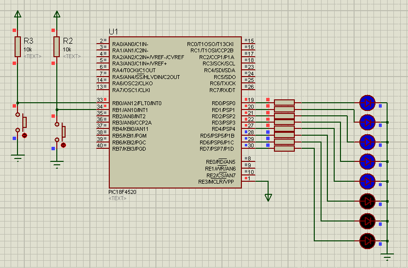

<h1>Contador com PIC-18F4520</h1>

Contador feito utilizando o microcontrolador PIC-18F4520 no simulador Proteus

 

<h2>Sobre o circuito</h2>

Foi utilizado:
  <ul>
    <li>1 microcontrolador PIC18F4520;</li>
    <li>2 push button;</li>
    <li>2 resistores de 10K Ohms;</li>
    <li>8 resistores de 330 Ohms;</li>
    <li>8 leds.</li>
  <ul>

Foi introduzido os resistores pull-up de 10K de modo que caso os botões não estejam sendo pressionados o microcontrolador ainda recebe corrente.

